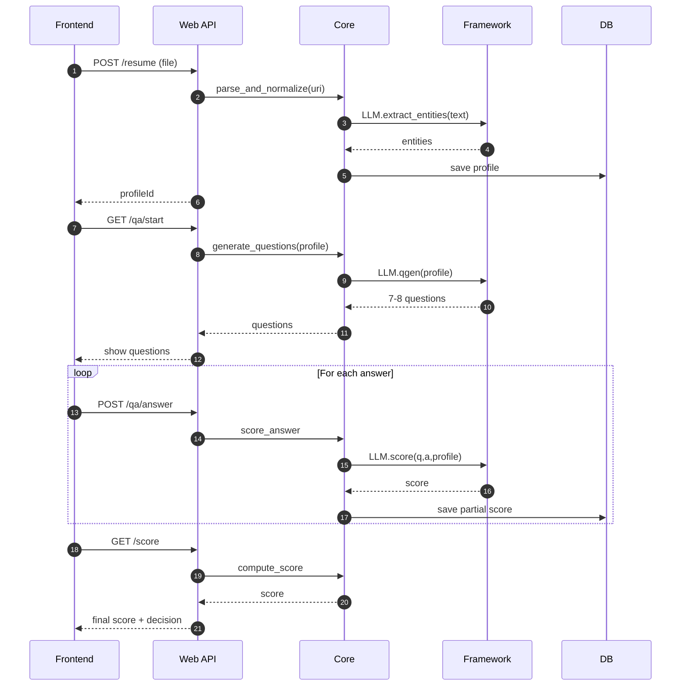

# Job Recommendation System 🚀

An **AI-driven job recommendation platform**.  
Users **log in**, **upload a resume**, and an **LLM generates 7–8 tailored questions**. Resume data + answers are scored:

- **Score < 60** → show popup warning, user may retry.  
- **Score ≥ 60** → system fetches jobs (e.g., from LinkedIn) and recommends them via **LangChain reranking**.

---

## ⚡ Quick Start in 1 Minute (with Docker)

```bash
git clone https://github.com/your-org/job-recommendation-system.git
cd job-recommendation-system
cp .env.example .env   # edit values
docker compose up -d   # build & start
```

**Access Points:**
- 🌐 **API** → http://localhost:8000/health
- 🗄️ **Database** → auto-created (schema + seed from data/sql/)

---

## 📂 Repository Structure

```
.
├── job-recommendation-framework/      # Framework: AI & LangChain
│   └── framework/
│
├── job-recommendation-system/         # Main system
│   ├── core/                          # business logic & entities
│   ├── web/                           # FastAPI API layer
│   ├── frontend/                      # React/NxT.js UI
│   └── data/sql/                      # DB migrations & seeds
│       ├── Major_01/
│       │   ├── Major1_DDL.sql
│       │   └── Major1_DML.sql
│       └── Major_02/
│           ├── Major2_DDL.sql
│           └── Major2_DML.sql
│
├── docker/                            # Docker configs
│   ├── Dockerfile.api
│   ├── entrypoint.api.sh
│   └── db-seed.sh
│
├── docker-compose.yml
├── .env.example
├── .dockerignore
├── Makefile                           # dev shortcuts
└── README.md
```

---

## 🧭 High-Level Flow

**Frontend (React/NxT.js)** → login, resume upload, Q&A, jobs view  
**API (FastAPI)** → /resume, /qa/*, /score, /jobs/recommend  
**Core** → parsing, scoring, job recommendation  
**Framework** → LangChain parsing assist, QGen, scoring, reranking  
**Job Source** → LinkedIn scraper / adapter  

**Final Score = 0.6 × ResumeScore + 0.4 × QAScore**  
- **< 60** → retry  
- **≥ 60** → job recommendations  


---

## 🔌 Module Responsibilities

### 🧠 **job-recommendation-framework**
- LLM-based resume parsing, question generation, answer scoring, job reranking.
- Independent package — plug & play with system.

### ⚙️ **job-recommendation-system**
- Core resume parser (non-LLM fallback).
- Scoring logic (resume + answers).
- Job fetching (LinkedIn scraper/integrator).
- API layer (/api/v1/resumesystem/*).
- React frontend (Login, Resume upload, Q&A, Jobs view).

---

## ⚙️ Tech Stack

**Backend:** Python 3.9.6, FastAPI (or Flask)  
**Frontend:** Nxt.Js + Tailwind  
**AI:** LangChain + LLMs  
**DBs:** PostgreSQL/MySQL, FAISS/PGVector, Redis/Elastic  
**Scraping:** LinkedIn (with compliance checks)  
**Infra:** Docker optional, .env configs for secrets  

---

## 🧪 Scoring Logic

**Final Score = 0.6 × Resume Score + 0.4 × Q&A Score**

**Threshold:**
- **< 60** → popup: "Your score is below 60"
- **≥ 60** → LinkedIn scraping + job recommendations

---

## 🧵 Sequence Diagram (Q&A Round)



---

## ⚙️ Local Installation

### 🐳 Option A — With Docker (recommended)

1. **Install Docker Desktop / Engine.**
2. **Copy environment file:**
   ```bash
   cp .env.example .env
   ```
   Set your database values in `.env`.
3. **Build & run:**
   ```bash
   docker compose up -d --build
   ```
4. **Verify:**
   - API health: http://localhost:8000/health
5. **Database migrations:**
   - Add new SQL in `job-recommendation-system/data/sql/Major_XX/`
   - Run migrations:
     ```bash
     docker compose up db_migrator --build
     ```
6. **Stop/reset:**
   ```bash
   docker compose down         # stop
   docker compose down -v      # stop + reset DB volume
   ```

### 💻 Option B — Without Docker

1. **Install Python 3.9.6 and MySQL 8.x.**
2. **Create database & user:**
   ```sql
   CREATE DATABASE your_db_name CHARACTER SET utf8 COLLATE utf8_general_ci;
   CREATE USER 'your_user'@'localhost' IDENTIFIED BY 'your_password';
   GRANT ALL PRIVILEGES ON your_db_name.* TO 'your_user'@'localhost';
   FLUSH PRIVILEGES;
   ```
3. **Apply SQL from `data/sql/`.**
4. **Install dependencies:**
   ```bash
   python3 -m venv venv
   source venv/bin/activate
   pip install -r job-recommendation-system/web/requirements.txt
   ```
5. **Run API:**
   ```bash
   cd job-recommendation-system/web
   uvicorn main:app --host 0.0.0.0 --port 8000 --workers 1
   ```

---

## 🔒 Security Notes

- 🔑 Use strong secrets in `.env` (never commit them)
- 🚫 Don't expose MySQL port in production
- 🔐 Use Docker secrets / Vault / Secret Manager in prod
- 🔒 Always store hashed passwords

---

## 🧪 Quick Test

**Insert a test user:**
```bash
docker compose exec mysql sh -lc '
  mysql -u"$MYSQL_USER" -p"$MYSQL_PASSWORD" -e "
    INSERT INTO $MYSQL_DB.users (username,email,password_hash,first_name,last_name,is_active,signInBy)
    VALUES (\"demo\",\"demo@example.com\",\"hash\",\"Demo\",\"User\",1,\"email\");
  "'
```

**Check the user:**
```bash
docker compose exec mysql sh -lc 'mysql -u"$MYSQL_USER" -p"$MYSQL_PASSWORD" -e "SELECT id,username,email FROM $MYSQL_DB.users;"'
```

---

## 🛠 Developer Commands (Makefile)

The Makefile provides shortcuts for common tasks:

```makefile
.PHONY: build up down reset logs api mysql migrator

build:      ## Build images
	docker compose build

up:         ## Start all services
	docker compose up -d

down:       ## Stop all services
	docker compose down

reset:      ## Stop and remove volumes (clean DB)
	docker compose down -v

logs:       ## Tail logs
	docker compose logs -f --tail=200

api:        ## Open shell in API container
	docker compose exec api bash

mysql:      ## Open MySQL CLI
	docker compose exec mysql mysql -u$$MYSQL_USER -p$$MYSQL_PASSWORD $$MYSQL_DB

migrator:   ## Run migrator only
	docker compose up db_migrator --build
```

**Usage:**
```bash
make up        # start everything
make logs      # see logs
make mysql     # connect to DB
make reset     # nuke DB + start fresh
```

---

## 📚 API Documentation

### Authentication Endpoints

| Method | Endpoint | Description |
|--------|----------|-------------|
| `POST` | `/auth/login` | User login |
| `POST` | `/auth/register` | User registration |
| `POST` | `/auth/logout` | User logout |

### Resume Processing

| Method | Endpoint | Description |
|--------|----------|-------------|
| `POST` | `/api/resume/upload` | Upload and parse resume |
| `GET` | `/api/resume/{id}` | Get resume analysis results |

### Q&A Session

| Method | Endpoint | Description |
|--------|----------|-------------|
| `GET` | `/api/qa/start` | Start Q&A session (7-8 questions) |
| `POST` | `/api/qa/answer` | Submit answer and get score |
| `GET` | `/api/qa/session/{id}` | Get session progress |

### Scoring & Jobs

| Method | Endpoint | Description |
|--------|----------|-------------|
| `GET` | `/api/score/final` | Get final combined score |
| `GET` | `/api/jobs/recommend` | Get job recommendations |
| `POST` | `/api/jobs/feedback` | Provide job feedback |

---

## 🐳 Docker Configuration

### Services

- **api**: FastAPI application (port 8000)
- **mysql**: MySQL database (port 3306)
- **db_migrator**: Database migration service (runs once)

### Environment Variables

```env
# Database
MYSQL_ROOT_PASSWORD=your_root_password
MYSQL_DATABASE=job_recommendation
MYSQL_USER=app_user
MYSQL_PASSWORD=app_password

# API
API_SECRET_KEY=your_secret_key
OPENAI_API_KEY=your_openai_key
LINKEDIN_API_KEY=your_linkedin_key

# Frontend
NEXT_PUBLIC_API_URL=http://localhost:8000
```

---

## 🔧 Development Setup

### Prerequisites

- Docker and Docker Compose
- Python 3.9.6+ (for local development)
- MySQL 8.x (for local development)
- Node.js 16+ (for frontend development)

### Development Workflow

1. **Clone the repository**
   ```bash
   git clone https://github.com/your-org/job-recommendation-system.git
   cd job-recommendation-system
   ```

2. **Setup environment**
   ```bash
   cp .env.example .env
   # Edit .env with your configuration
   ```

3. **Start development services**
   ```bash
   make up
   ```

4. **Access development tools**
   - API: http://localhost:8000/docs
   - Frontend: http://localhost:3000
   - Database: localhost:3306

---

## 🚀 Deployment

### Production Deployment

1. **Setup production environment**
   ```bash
   cp .env.production.example .env.production
   # Configure production values
   ```

2. **Deploy with Docker Compose**
   ```bash
   docker-compose -f docker-compose.prod.yml up -d
   ```

3. **Monitor deployment**
   ```bash
   docker-compose -f docker-compose.prod.yml logs -f
   ```

### Cloud Deployment

The system supports deployment on:
- AWS ECS/EKS
- Google Cloud Run
- Azure Container Instances
- Heroku Container Registry

---

## 🤝 Contributing

We welcome contributions! Please see our [CONTRIBUTING.md](CONTRIBUTING.md) for details.

### Development Guidelines

1. **Fork the repository**
2. **Create a feature branch**
3. **Follow coding standards**
4. **Write tests for new features**
5. **Submit pull request**

### Code Style

- **Python**: PEP 8 compliance
- **JavaScript**: ESLint with standard config
- **SQL**: Proper indexing and constraints
- **Docker**: Multi-stage builds for optimization

---

## 📊 Monitoring & Logging

### Health Checks

```bash
# API health
curl http://localhost:8000/health

# Database health
docker compose exec mysql mysqladmin ping

# Service status
docker compose ps
```

### Log Management

```bash
# View all logs
docker compose logs -f

# Service-specific logs
docker compose logs -f api
docker compose logs -f mysql

# Log levels (set in .env)
LOG_LEVEL=INFO  # DEBUG, INFO, WARNING, ERROR
```

---

## 🐛 Troubleshooting

### Common Issues

**Port conflicts:**
```bash
# Check port usage
netstat -tulpn | grep :8000

# Change ports in docker-compose.yml
```

**Database connection issues:**
```bash
# Check MySQL status
docker compose ps mysql

# Reset database
make reset
make up
```

**Build failures:**
```bash
# Clean build
docker compose build --no-cache

# Check Docker daemon
docker info
```

---

## 📞 Support

- **GitHub Issues**: [Report bugs](https://github.com/your-org/job-recommendation-system/issues)
- **Documentation**: [Full docs](https://github.com/your-org/job-recommendation-system/docs)
- **Email**: support@your-org.com

---

## 📄 License

This project is licensed under the MIT License - see the [LICENSE](LICENSE) file for details.

---

<div align="center">

**Happy job hunting!** 🎯

[⭐ Star us on GitHub](https://github.com/your-org/job-recommendation-system)

</div>