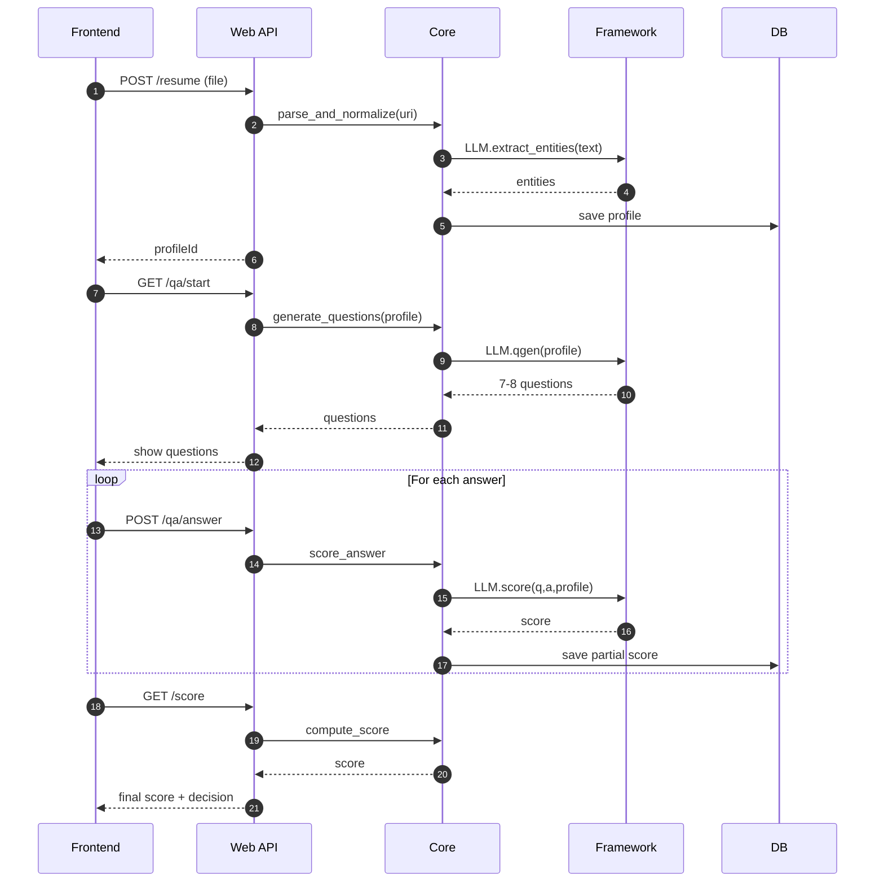

# Job Recommendation System 🚀

An **AI-driven job recommendation platform**.  
Users **log in**, **upload a resume**, and an **LLM generates 7–8 tailored questions**. Resume data + answers are scored:

- **Score < 60** → show popup warning, user may retry.  
- **Score ≥ 60** → system fetches jobs (e.g., from LinkedIn) and recommends them via **LangChain reranking**.

---

## ⚡ Quick Start in 1 Minute (with Docker)

```bash
git clone https://github.com/your-org/job-recommendation-system.git
cd job-recommendation-system
cp .env.example .env   # edit values
docker compose up -d   # build & start
```

**Access Points:**
- 🌐 **API** → http://localhost:8000/health
- 🗄️ **Database** → auto-created (schema + seed from data/sql/)

---

## 📂 Repository Structure

```
.
├── job-recommendation-framework/      # Framework: AI & LangChain
│   └── framework/
│
├── job-recommendation-system/         # Main system
│   ├── core/                          # business logic & entities
│   ├── web/                           # FastAPI API layer
│   ├── frontend/                      # React/NxT.js UI
│   └── data/sql/                      # DB migrations & seeds
│       ├── Major_01/
│       │   ├── Major1_DDL.sql
│       │   └── Major1_DML.sql
│       └── Major_02/
│           ├── Major2_DDL.sql
│           └── Major2_DML.sql
│
├── docker/                            # Docker configs
│   ├── Dockerfile.api
│   ├── entrypoint.api.sh
│   └── db-seed.sh
│
├── docker-compose.yml
├── .env.example
├── .dockerignore
├── Makefile                           # dev shortcuts
└── README.md
```

---

## 🧭 High-Level Flow

**Frontend (React/NxT.js)** → login, resume upload, Q&A, jobs view  
**API (FastAPI)** → /resume, /qa/*, /score, /jobs/recommend  
**Core** → parsing, scoring, job recommendation  
**Framework** → LangChain parsing assist, QGen, scoring, reranking  
**Job Source** → LinkedIn scraper / adapter  

**Final Score = 0.6 × ResumeScore + 0.4 × QAScore**  
- **< 60** → retry  
- **≥ 60** → job recommendations  


---

## 🔌 Module Responsibilities

### 🧠 **job-recommendation-framework**
- LLM-based resume parsing, question generation, answer scoring, job reranking.
- Independent package — plug & play with system.

### ⚙️ **job-recommendation-system**
- Core resume parser (non-LLM fallback).
- Scoring logic (resume + answers).
- Job fetching (LinkedIn scraper/integrator).
- API layer (/api/v1/resumesystem/*).
- React frontend (Login, Resume upload, Q&A, Jobs view).

---

## ⚙️ Tech Stack

**Backend:** Python 3.9.6, FastAPI (or Flask)  
**Frontend:** Nxt.Js + Tailwind  
**AI:** LangChain + LLMs  
**DBs:** PostgreSQL/MySQL, FAISS/PGVector, Redis/Elastic  
**Scraping:** LinkedIn (with compliance checks)  
**Infra:** Docker optional, .env configs for secrets  

---

## 🧪 Scoring Logic

**Final Score = 0.6 × Resume Score + 0.4 × Q&A Score**

**Threshold:**
- **< 60** → popup: "Your score is below 60"
- **≥ 60** → LinkedIn scraping + job recommendations

---

## 🧵 Sequence Diagram (Q&A Round)




---

## 🤝 Contributing

We welcome contributions! Please see our [CONTRIBUTING.md](CONTRIBUTING.md) for details.

### Development Guidelines

1. **Fork the repository**
2. **Create a feature branch**
3. **Follow coding standards**
4. **Write tests for new features**
5. **Submit pull request**

### Code Style

- **Python**: PEP 8 compliance
- **JavaScript**: ESLint with standard config
- **SQL**: Proper indexing and constraints
- **Docker**: Multi-stage builds for optimization

---

## 📊 Monitoring & Logging

### Health Checks

```bash
# API health
curl http://localhost:8000/health

# Database health
docker compose exec mysql mysqladmin ping

# Service status
docker compose ps
```

### Log Management

```bash
# View all logs
docker compose logs -f

# Service-specific logs
docker compose logs -f api
docker compose logs -f mysql

# Log levels (set in .env)
LOG_LEVEL=INFO  # DEBUG, INFO, WARNING, ERROR
```

---

## 🐛 Troubleshooting

### Common Issues

**Port conflicts:**
```bash
# Check port usage
netstat -tulpn | grep :8000

# Change ports in docker-compose.yml
```

**Database connection issues:**
```bash
# Check MySQL status
docker compose ps mysql

# Reset database
make reset
make up
```

**Build failures:**
```bash
# Clean build
docker compose build --no-cache

# Check Docker daemon
docker info
```

---

## 📞 Support

- **GitHub Issues**: [Report bugs](https://github.com/your-org/job-recommendation-system/issues)
- **Documentation**: [Full docs](https://github.com/your-org/job-recommendation-system/docs)
- **Email**: support@your-org.com

---

## 📄 License

This project is licensed under the MIT License - see the [LICENSE](LICENSE) file for details.

---


<div align="center">

**Happy job hunting!** 🎯

[⭐ Star us on GitHub](https://github.com/your-org/job-recommendation-system)

</div>
