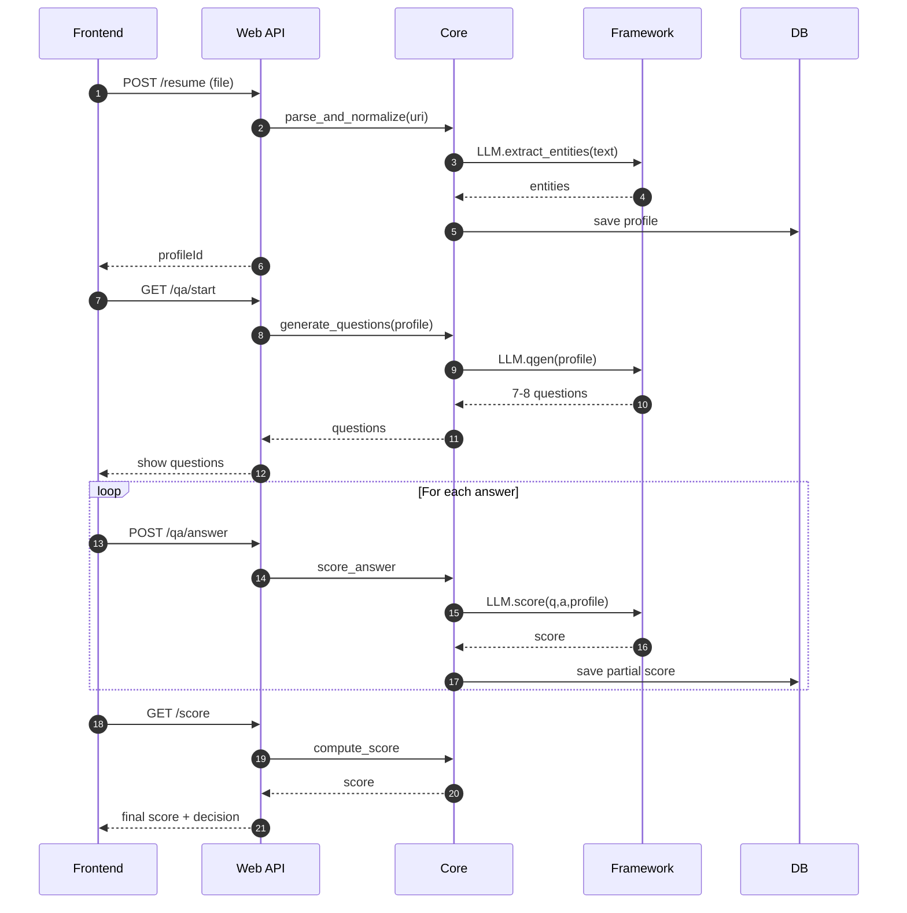

# Job Recommendation System 🚀

An **AI-driven job recommendation platform**.  
Users **log in**, **upload a resume**, and an **LLM generates 7–8 tailored questions**. Resume data + answers are scored:

- **Score < 60** → show popup warning, user may retry.
- **Score ≥ 60** → system fetches jobs (e.g., from LinkedIn) and recommends them via **LangChain reranking**.

---

## ⚡ Quick Start in 1 Minute (with Docker)

```bash
git clone https://github.com/your-org/job-recommendation-system.git
cd job-recommendation-system
cp .env.example .env   # edit values
docker compose up -d   # build & start
```

**Access Points:**

- 🌐 **API** → http://localhost:8000/health
- 🗄️ **Database** → auto-created (schema + migrations from data/sql/)

---

## 🛠️ Development Workflow

### Running Development Scripts

We provide automated development scripts that handle Docker services, code quality checks, and testing:

#### **For Linux/macOS:**

```bash
# Using npm script (recommended)
npm run devrun

# Or directly
./devrun.sh
```

#### **For Windows:**

```cmd
devrun.cmd
```

### What the Dev Scripts Do

The `devrun` scripts automate your entire development workflow:

1. **🐳 Start Docker Services** - Brings up all containers (backend, frontend, databases, etc.)
2. **🔍 Run Quality Checks:**
   - **Python (Backend):**
     - `ruff` - Fast Python linter
     - `black --check` - Code formatting verification
     - `pytest` - Run all tests
   - **Node.js (Frontend):**
     - `eslint` - JavaScript/TypeScript linting
     - `prettier --check` - Code formatting verification
     - `next lint` - Next.js specific linting
     - `jest` - Run all frontend tests
3. **📊 Generate Summary** - Shows which checks passed/failed
4. **🛑 Clean Shutdown** - Automatically stops Docker services when done

### Exit Codes

- `0` - All checks passed ✅
- `1` - One or more checks failed ❌

### Prerequisites

Before running the dev scripts, ensure you have:

- **Docker** & **Docker Compose** installed
- **Node.js** & **npm** installed (for npm script)
- **Executable permissions** (Linux/macOS):
  ```bash
  chmod +x devrun.sh
  ```

### Development Best Practices

1. **Run before committing:**

   ```bash
   npm run devrun  # Ensures code quality before pushing
   ```

2. **Fix issues automatically (where possible):**

   ```bash
   # Python formatting
   docker compose exec backend black .

   # Node formatting
   docker compose exec frontend npx prettier --write .
   ```

3. **Run specific checks:**

   ```bash
   # Just Python tests
   docker compose exec backend pytest

   # Just frontend linting
   docker compose exec frontend npx eslint .
   ```

### Troubleshooting Dev Scripts

**Script exits immediately:**

- Check Docker is running: `docker --version`
- Verify Docker Compose: `docker compose version`

**Permission denied (Linux/macOS):**

```bash
chmod +x devrun.sh
```

**Checks failing:**

- Review the specific error messages in the output
- Run formatters to auto-fix: `black .` or `prettier --write .`
- Check test logs for failing tests

**Services won't start:**

```bash
# Clean restart
docker compose down -v
docker compose up -d
```

---

## 🌱 Environment Modes

The entire stack now reads a single `SERVER_ENV` flag (`local`, `staging`, `production`) so you can branch logic with simple helpers:

- **Backend** (`common/server_environment.py`) exposes `get_server_environment()` which returns booleans like `is_local`, `is_staging`, `is_prod`. Both FastAPI apps (Job API + Resume Reader) import this helper so any service can branch on the same flags.
- **Frontend** (`job-recommendation-system/front-end/lib/server/environment.ts`) mirrors the same contract so API routes and pages can ask for `isLocal`, `isStaging`, etc.
- **Any other frontend** (e.g., a future Resume Reader UI) can import from `frontend-common/environment` directly:

```ts
import { resolveServerEnvironment } from "../../frontend-common/environment";

const serverEnv = resolveServerEnvironment();
if (serverEnv.isLocal) {
  // local-only logic
}
```

Supporting variables (all live in `.env` / deployment secrets):

| Variable             | Purpose                                   | Example                          |
| -------------------- | ----------------------------------------- | -------------------------------- |
| `SERVER_ENV`         | Active environment slug                   | `local`, `staging`, `production` |
| `API_BASE_URL`       | Where the frontend talks to the backend   | `http://localhost:8000`          |
| `FRONTEND_ORIGIN`    | Primary UI origin allowed by CORS         | `http://localhost:3000`          |
| `CORS_EXTRA_ORIGINS` | Optional comma list of additional origins | `https://staging.example.com`    |

When `SERVER_ENV=local`, sensible defaults are applied (localhost ports). For staging/prod just set the URLs explicitly—both backend and frontend modules will stay in sync.

---

## 📂 Repository Structure

```
.
├── job-recommendation-framework/      # Framework: AI & LangChain
│   └── framework/
│
├── job-recommendation-system/         # Main system
│   ├── core/                          # business logic & entities
│   ├── web/                           # FastAPI API layer
│   ├── frontend/                      # React/NxT.js UI
│   └── data/sql/                      # DB migrations (DDL/DML)
│       ├── Major_01_00_00/            # schema
│       └── Major_02_00_00/            # future DDL
│
├── docker/                            # Docker configs
│   ├── Dockerfile.api
│   ├── entrypoint.api.sh
│   └── db-seed.sh
│
├── docker-compose.yml
├── .env.example
├── .dockerignore
├── Makefile                           # dev shortcuts
└── README.md
```

---

## ⚡ Quick Command Reference

| Task               | Command                                               | Description                                             |
| ------------------ | ----------------------------------------------------- | ------------------------------------------------------- |
| **Run all checks** | `npm run devrun`                                      | Start services, run all quality checks, generate report |
| **Start services** | `docker compose up -d`                                | Start all containers in background                      |
| **Stop services**  | `docker compose down`                                 | Stop all containers                                     |
| **View logs**      | `docker compose logs -f`                              | Follow logs from all services                           |
| **Service logs**   | `docker compose logs -f backend`                      | Follow logs from specific service                       |
| **Format Python**  | `docker compose exec backend black .`                 | Auto-format Python code                                 |
| **Format Node**    | `docker compose exec frontend npx prettier --write .` | Auto-format frontend code                               |
| **Python tests**   | `docker compose exec backend pytest`                  | Run backend tests                                       |
| **Frontend tests** | `docker compose exec frontend npx jest`               | Run frontend tests                                      |
| **Rebuild**        | `docker compose build --no-cache`                     | Clean rebuild all containers                            |
| **Database reset** | `docker compose down -v && docker compose up -d`      | Reset database and restart                              |

---

## 🧭 High-Level Flow

**Frontend (React/NxT.js)** → login, resume upload, Q&A, jobs view  
**API (FastAPI)** → /resume, /qa/\*, /score, /jobs/recommend  
**Core** → parsing, scoring, job recommendation  
**Framework** → LangChain parsing assist, QGen, scoring, reranking  
**Job Source** → LinkedIn scraper / adapter

**Final Score = 0.6 × ResumeScore + 0.4 × QAScore**

- **< 60** → retry
- **≥ 60** → job recommendations


---

## 🔌 Module Responsibilities

### 🧠 **job-recommendation-framework**

- LLM-based resume parsing, question generation, answer scoring, job reranking.
- Independent package — plug & play with system.

### ⚙️ **job-recommendation-system**

- Core resume parser (non-LLM fallback).
- Scoring logic (resume + answers).
- Job fetching (LinkedIn scraper/integrator).
- API layer (/api/v1/resumesystem/\*).
- React frontend (Login, Resume upload, Q&A, Jobs view).

## ⚙️ Tech Stack

**Backend:** Python 3.9.6, FastAPI (or Flask)  
**Frontend:** Nxt.Js + Tailwind  
**AI:** LangChain + LLMs  
**DBs:** PostgreSQL/MySQL, FAISS/PGVector, Redis/Elastic  
**Scraping:** LinkedIn (with compliance checks)  
**Infra:** Docker optional, .env configs for secrets

---

## 🧪 Scoring Logic

**Final Score = 0.6 × Resume Score + 0.4 × Q&A Score**

**Threshold:**

- **< 60** → popup: "Your score is below 60"
- **≥ 60** → LinkedIn scraping + job recommendations

---

## 🧵 Sequence Diagram (Q&A Round)


```mermaid
sequenceDiagram
  autonumber
  participant FE as Frontend
  participant API as Web API
  participant CORE as Core
  participant FW as Framework
  participant DB as DB

  FE->>API: POST /resume (file)
  API->>CORE: parse_and_normalize(uri)
  CORE->>FW: LLM.extract_entities(text)
  FW-->>CORE: entities
  CORE->>DB: save profile
  API-->>FE: profileId

  FE->>API: GET /qa/start
  API->>CORE: generate_questions(profile)
  CORE->>FW: LLM.qgen(profile)
  FW-->>CORE: 7-8 questions
  CORE-->>API: questions
  API-->>FE: show questions

  loop For each answer
    FE->>API: POST /qa/answer
    API->>CORE: score_answer
    CORE->>FW: LLM.score(q,a,profile)
    FW-->>CORE: score
    CORE->>DB: save partial score
  end

  FE->>API: GET /score
  API->>CORE: compute_score
  CORE-->>API: score
  API-->>FE: final score + decision
```

---

## 🤝 Contributing

We welcome contributions! Please see our [CONTRIBUTING.md](CONTRIBUTING.md) for details.

### Development Guidelines

1. **Fork the repository**
2. **Create a feature branch**
3. **Follow coding standards**
4. **Write tests for new features**
5. **Run quality checks** - Use `npm run devrun` to ensure all checks pass
6. **Submit pull request**

### Code Style

- **Python**: PEP 8 compliance (enforced by `ruff` and `black`)
- **JavaScript**: ESLint with standard config
- **SQL**: Proper indexing and constraints
- **Docker**: Multi-stage builds for optimization

> 💡 **Tip:** Run `npm run devrun` before committing to catch issues early!

---

## 📊 Monitoring & Logging

### Health Checks

```bash
# API health
curl http://localhost:8000/health

# Database health
docker compose exec mysql mysqladmin ping

# Service status
docker compose ps
```

### Log Management

```bash
# View all logs
docker compose logs -f

# Service-specific logs
docker compose logs -f api
docker compose logs -f mysql

# Log levels (set in .env)
LOG_LEVEL=INFO  # DEBUG, INFO, WARNING, ERROR
```

---

## 🐛 Troubleshooting

### Common Issues

**Port conflicts:**

```bash
# Check port usage
netstat -tulpn | grep :8000

# Change ports in docker-compose.yml
```

**Database connection issues:**

```bash
# Check MySQL status
docker compose ps mysql

# Reset database
make reset
make up
```

**Build failures:**

```bash
# Clean build
docker compose build --no-cache

# Check Docker daemon
docker info
```

---

## 📞 Support

- **GitHub Issues**: [Report bugs](https://github.com/your-org/job-recommendation-system/issues)
- **Documentation**: [Full docs](https://github.com/your-org/job-recommendation-system/docs)
- **Email**: support@your-org.com

---

## 📄 License

This project is licensed under the MIT License - see the [LICENSE](LICENSE) file for details.

---

<div align="center">

**Happy job hunting!** 🎯

[⭐ Star us on GitHub](https://github.com/your-org/job-recommendation-system)

</div>
